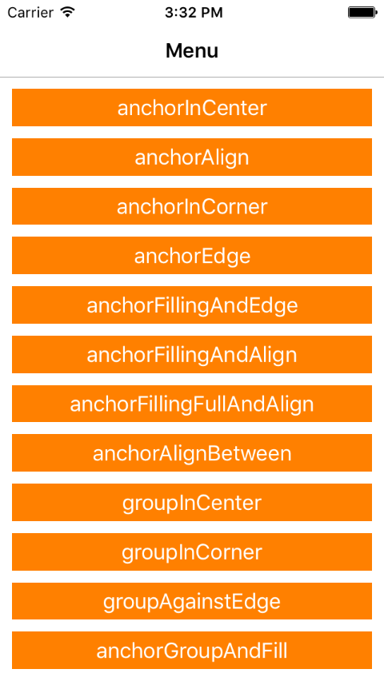
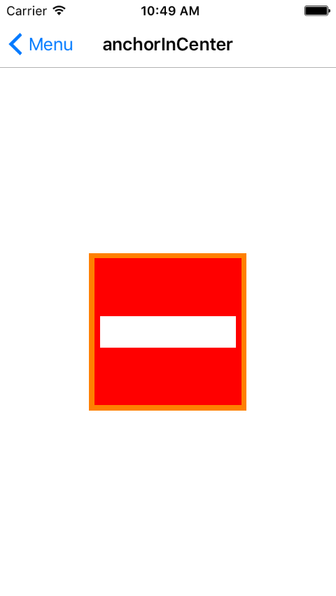
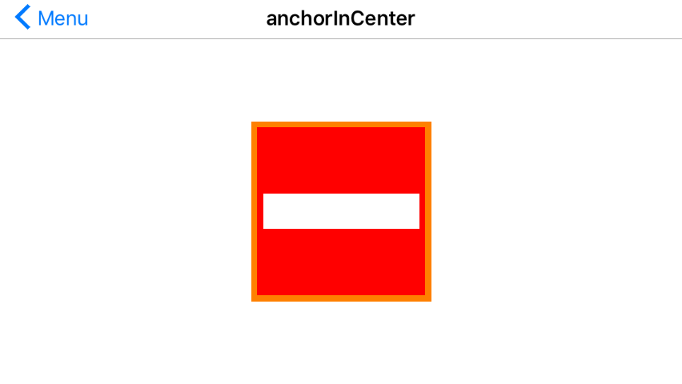
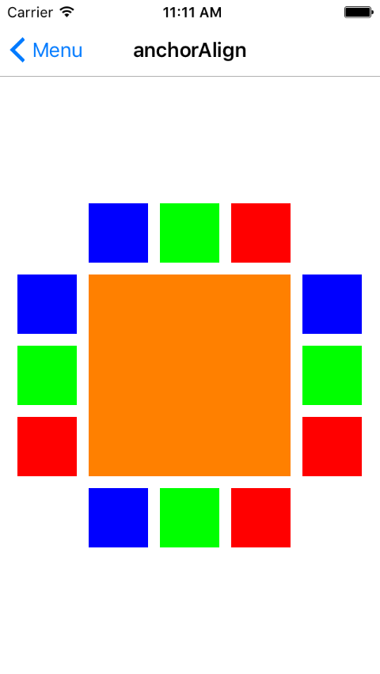
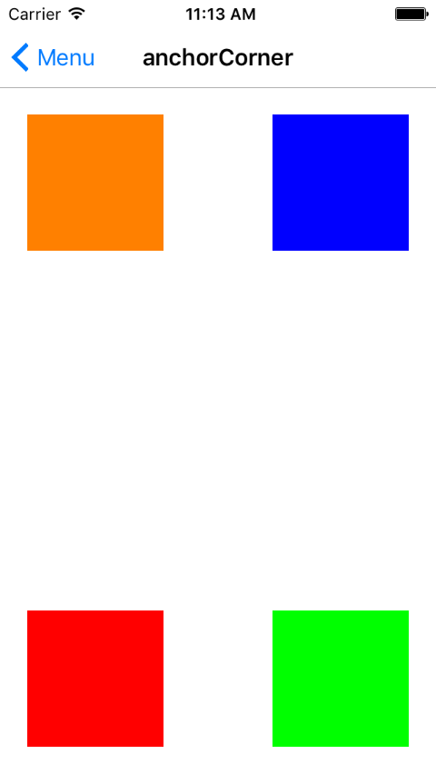
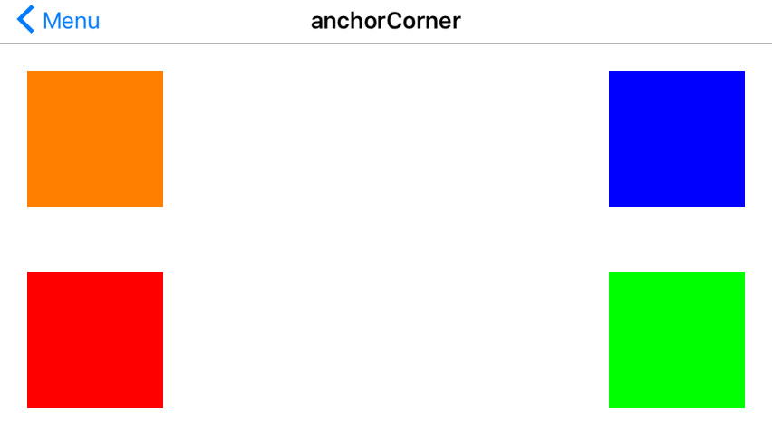
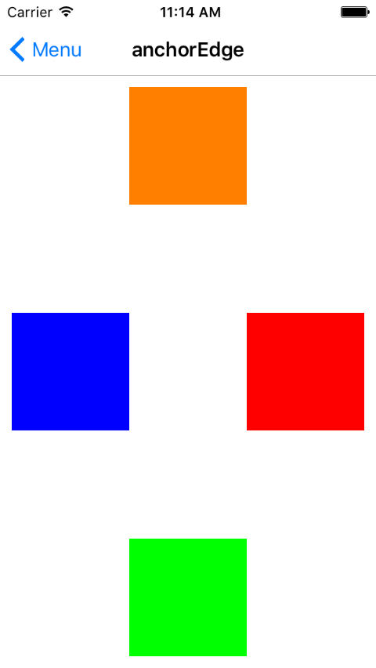
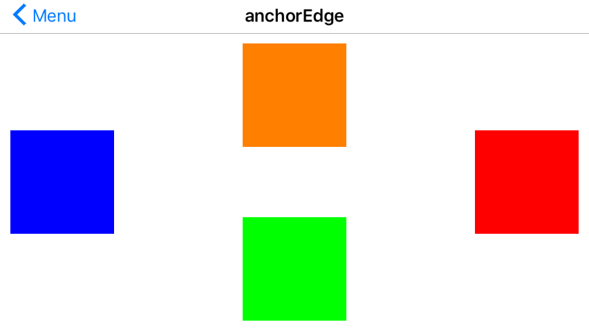

# UI-Design-Swift BETA V1.1.0

UIView extention 排版功能類似 Stakeview


開發環境：

Xcode 7.2

OS X 10.11.2

SWIFT

支持 iOS 8.0 以上

Example：

Menu:



### anchorInCenter :

```swift 
orangeColorView.anchorInCenter(originView: UIView, width: size , height: size , autoscall: Bool )
redColorview0.anchorInCenterFill(View01, gap: 5)
```



### anchorAlign

```swift
AboveMatchingLeft.anchorAlign(contenter, relativeTo: baseView, edgeType: anchorType.AboveMatchingLeft, gap: 10, width: 50, height: 50, autoscall: false)

AboveCentered.anchorAlign(contenter, relativeTo: baseView, edgeType: anchorType.AboveCentered, gap: 10, width: 50, height: 50, autoscall: false)

AboveMatchingRight.anchorAlign(contenter, relativeTo: baseView, edgeType: anchorType.AboveMatchingRight, gap: 10, width: 50, height: 50, autoscall: false)

ToTheRightMatchingTop.anchorAlign(contenter, relativeTo: baseView, edgeType: anchorType.ToTheRightMatchingTop, gap: 10, width: 50, height: 50, autoscall: false)

ToTheRightCentered.anchorAlign(contenter, relativeTo: baseView, edgeType: anchorType.ToTheRightCentered, gap: 10, width: 50, height: 50, autoscall: false)

ToTheRightMatchingBottom.anchorAlign(contenter, relativeTo: baseView, edgeType: anchorType.ToTheRightMatchingBottom, gap: 10, width: 50, height: 50, autoscall: false)

UnderMatchingRight.anchorAlign(contenter, relativeTo: baseView, edgeType: anchorType.UnderMatchingRight, gap: 10, width: 50, height: 50, autoscall: false)

UnderCentered.anchorAlign(contenter, relativeTo: baseView, edgeType: anchorType.UnderCentered, gap: 10, width: 50, height: 50, autoscall: false)

UnderMatchingLeft.anchorAlign(contenter, relativeTo: baseView, edgeType: anchorType.UnderMatchingLeft, gap: 10, width: 50, height: 50, autoscall: false)

ToTheLeftMatchingBottom.anchorAlign(contenter, relativeTo: baseView, edgeType: anchorType.ToTheLeftMatchingBottom, gap: 10, width: 50, height: 50, autoscall: false)

ToTheLeftCentered.anchorAlign(contenter, relativeTo: baseView, edgeType: anchorType.ToTheLeftCentered, gap: 10, width: 50, height: 50, autoscall: false)

ToTheLeftMatchingTop.anchorAlign(contenter, relativeTo: baseView, edgeType: anchorType.ToTheLeftMatchingTop, gap: 10, width: 50, height: 50, autoscall: false)
```



### anchorInCorner

```swift
//TopLeft
baseView.anchorInCorner(contenter, edgeType: anchorType.TopLeft, gap_x: 20, gap_y: 20, width: 100, height: 100)

//TopRight
TopRight.anchorInCorner(contenter, edgeType: anchorType.TopRight, gap_x: 20, gap_y: 20, width: 100, height: 100)

//BottomLeft
BottomLeft.anchorInCorner(contenter, edgeType: anchorType.BottomLeft, gap_x: 20, gap_y: 20, width: 100, height: 100)

//BottomRight
BottomRight.anchorInCorner(contenter, edgeType: anchorType.BottomRight, gap_x: 20, gap_y: 20, width: 100, height: 100)

```




### anchorEdge

```swift
//Top
Top.anchorEdge(contenter, edgeType: anchorType.Top, gap: 10, width: 100, height: 100)

//Left
Left.anchorEdge(contenter, edgeType: anchorType.Left, gap: 10, width: 100, height: 100)

//Bottom
Bottom.anchorEdge(contenter, edgeType: anchorType.Bottom, gap: 10, width: 100, height: 100)

//Right
Right.anchorEdge(contenter, edgeType: anchorType.Right, gap: 10, width: 100, height: 100)

```




### License

The MIT License (MIT)
