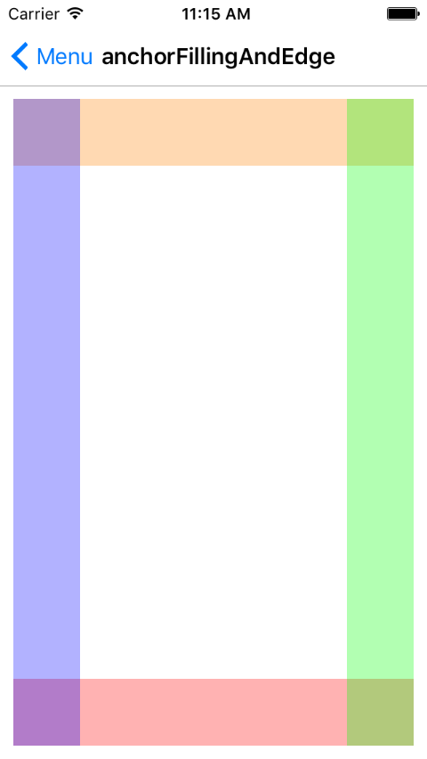
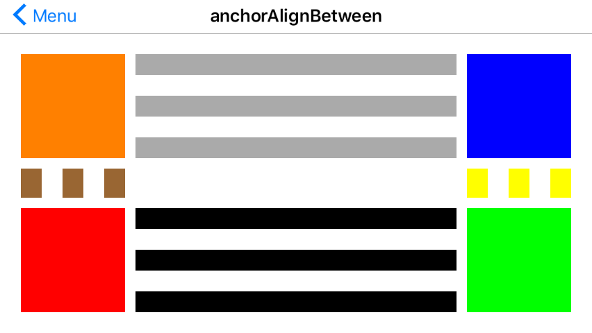

# UI-Design-Swift BETA V1.0.0

UIView extention 排版功能類似 Stakeview

可動態改變Size ，可自動放大或縮小UIView的Size比例。

開發環境：

Xcode 7.2

OS X 10.11.2

SWIFT

支持 iOS 7.0 以上

Example：

Menu:


### anchorInCenter :

```swift 
View01.anchorInCenter(originView: UIView, width: size , height: size , autoscall: Bool )
view02.anchorInCenterFill(View01, gap: 5)
```


### anchorAlign

```swift
AboveMatchingLeft.anchorAlign(contenter, relativeTo: baseView, edgeType: anchorType.AboveMatchingLeft, gap: 10, width: 50, height: 50, autoscall: false)

AboveCentered.anchorAlign(contenter, relativeTo: baseView, edgeType: anchorType.AboveCentered, gap: 10, width: 50, height: 50, autoscall: false)

AboveMatchingRight.anchorAlign(contenter, relativeTo: baseView, edgeType: anchorType.AboveMatchingRight, gap: 10, width: 50, height: 50, autoscall: false)

ToTheRightMatchingTop.anchorAlign(contenter, relativeTo: baseView, edgeType: anchorType.ToTheRightMatchingTop, gap: 10, width: 50, height: 50, autoscall: false)

ToTheRightCentered.anchorAlign(contenter, relativeTo: baseView, edgeType: anchorType.ToTheRightCentered, gap: 10, width: 50, height: 50, autoscall: false)

ToTheRightMatchingBottom.anchorAlign(contenter, relativeTo: baseView, edgeType: anchorType.ToTheRightMatchingBottom, gap: 10, width: 50, height: 50, autoscall: false)

UnderMatchingRight.anchorAlign(contenter, relativeTo: baseView, edgeType: anchorType.UnderMatchingRight, gap: 10, width: 50, height: 50, autoscall: false)

UnderCentered.anchorAlign(contenter, relativeTo: baseView, edgeType: anchorType.UnderCentered, gap: 10, width: 50, height: 50, autoscall: false)

UnderMatchingLeft.anchorAlign(contenter, relativeTo: baseView, edgeType: anchorType.UnderMatchingLeft, gap: 10, width: 50, height: 50, autoscall: false)

ToTheLeftMatchingBottom.anchorAlign(contenter, relativeTo: baseView, edgeType: anchorType.ToTheLeftMatchingBottom, gap: 10, width: 50, height: 50, autoscall: false)

ToTheLeftCentered.anchorAlign(contenter, relativeTo: baseView, edgeType: anchorType.ToTheLeftCentered, gap: 10, width: 50, height: 50, autoscall: false)

ToTheLeftMatchingTop.anchorAlign(contenter, relativeTo: baseView, edgeType: anchorType.ToTheLeftMatchingTop, gap: 10, width: 50, height: 50, autoscall: false)
```


### anchorInCorner

```swift
//TopLeft
baseView.anchorInCorner(contenter, edgeType: anchorType.TopLeft, gap_x: 20, gap_y: 20, width: 100, height: 100)

//TopRight
TopRight.anchorInCorner(contenter, edgeType: anchorType.TopRight, gap_x: 20, gap_y: 20, width: 100, height: 100)

//BottomLeft
BottomLeft.anchorInCorner(contenter, edgeType: anchorType.BottomLeft, gap_x: 20, gap_y: 20, width: 100, height: 100)

//BottomRight
BottomRight.anchorInCorner(contenter, edgeType: anchorType.BottomRight, gap_x: 20, gap_y: 20, width: 100, height: 100)

```


### anchorEdge

```swift
//Top
Top.anchorEdge(contenter, edgeType: anchorType.Top, gap: 10, width: 100, height: 100)

//Left
Left.anchorEdge(contenter, edgeType: anchorType.Left, gap: 10, width: 100, height: 100)

//Bottom
Bottom.anchorEdge(contenter, edgeType: anchorType.Bottom, gap: 10, width: 100, height: 100)

//Right
Right.anchorEdge(contenter, edgeType: anchorType.Right, gap: 10, width: 100, height: 100)

```


### anchorFillingAndEdge

```swift
//Top
Top.anchorFillingAndEdge(contenter, edgeType: anchorType.Top, gap_x: 10, gap_y: 10, othersize: 50, autoscall: false)

//Bottom
Bottom.anchorFillingAndEdge(contenter, edgeType: anchorType.Bottom, gap_x: 10, gap_y: 10, othersize: 50, autoscall: false)

//Left
Left.anchorFillingAndEdge(contenter, edgeType: anchorType.Left, gap_x: 10, gap_y: 10, othersize: 50, autoscall: false)

//Right
Right.anchorFillingAndEdge(contenter, edgeType: anchorType.Right, gap_x: 10, gap_y: 10, othersize: 50, autoscall: false)

```




### anchorFillingAndAlign

```swift

view03.anchorAlignAndFillWidth(contenter, relativeTo: baseView03, edgeType: anchorType.ToTheLeftMatchingBottom, gap: 10, height: 30, autoscall: false)

view04.anchorAlignAndFillWidth(contenter, relativeTo: baseView03, edgeType: anchorType.ToTheRightMatchingTop, gap: 10, height: 30, autoscall: false)

view05.anchorAlignAndFillHeight(contenter, relativeTo: baseView03, edgeType: anchorType.AboveMatchingLeft, gap: 10, width: 30, autoscall: false)

view06.anchorAlignAndFillHeight(contenter, relativeTo: baseView03, edgeType: anchorType.UnderMatchingRight, gap: 10, width: 30, autoscall: false)
```


### anchorFillingFullAndAlign

```swift

view03.anchorAlignAndFillFull(contenter, relativeTo: baseView03, edgeType: anchorType.ToTheLeftMatchingBottom, gap: 10)

view04.anchorAlignAndFillFull(contenter, relativeTo: baseView03, edgeType: anchorType.ToTheRightMatchingTop, gap: 10)

view05.anchorAlignAndFillFull(contenter, relativeTo: baseView03, edgeType: anchorType.AboveMatchingLeft, gap: 10)

view06.anchorAlignAndFillFull(contenter, relativeTo: baseView03, edgeType: anchorType.UnderMatchingRight, gap: 10)

```


### anchorAlignBetween

```swift

//Between TopLeft and TopRight and align ToTheRightMatchingTop
AlignBetweenHorizontal.backgroundColor = UIColor.lightGrayColor()
AlignBetweenHorizontal.anchorAlignBetween(
contenter,
primaryView: TopLeft,
secondaryView: TopRight,
edgeType: anchorType.AlignBetweenHorizontal,
aligntype:anchorType.ToTheRightMatchingTop,
gap: 10, othersize: 20, autoscall: false)

//Between TopLeft and TopRight and align ToTheRightCentered
AlignBetweenHorizontal_ToTheRightCentered.backgroundColor = UIColor.lightGrayColor()
AlignBetweenHorizontal_ToTheRightCentered.anchorAlignBetween(
contenter,
primaryView: TopLeft,
secondaryView: TopRight,
edgeType: anchorType.AlignBetweenHorizontal,
aligntype:anchorType.ToTheRightCentered,
gap: 10, othersize: 20, autoscall: false)

//Between TopLeft and TopRight and align ToTheRightMatchingBottom
AlignBetweenHorizontal_ToTheRightMatchingBottom.backgroundColor = UIColor.lightGrayColor()
AlignBetweenHorizontal_ToTheRightMatchingBottom.anchorAlignBetween(
contenter,
primaryView: TopLeft,
secondaryView: TopRight,
edgeType: anchorType.AlignBetweenHorizontal,
aligntype:anchorType.ToTheRightMatchingBottom,
gap: 10, othersize: 20, autoscall: false)

//Between BottomLeft and BottomRight and align ToTheLeftMatchingBottom
AlignBetweenHorizontal_ToTheLeftMatchingBottom.backgroundColor = UIColor.blackColor()
AlignBetweenHorizontal_ToTheLeftMatchingBottom.anchorAlignBetween(
contenter,
primaryView: BottomRight,
secondaryView: BottomLeft,
edgeType: anchorType.AlignBetweenHorizontal,
aligntype: anchorType.ToTheLeftMatchingBottom,
gap: 10, othersize: 20, autoscall: false)

//Between BottomLeft and BottomRight and align ToTheLeftCentered
AlignBetweenHorizontal_ToTheLeftCentered.backgroundColor = UIColor.blackColor()
AlignBetweenHorizontal_ToTheLeftCentered.anchorAlignBetween(
contenter,
primaryView: BottomRight,
secondaryView: BottomLeft,
edgeType: anchorType.AlignBetweenHorizontal,
aligntype: anchorType.ToTheLeftCentered,
gap: 10, othersize: 20, autoscall: false)

//Between BottomLeft and BottomRight and align ToTheLeftMatchingTop
AlignBetweenHorizontal_ToTheLeftMatchingTop.backgroundColor = UIColor.blackColor()
AlignBetweenHorizontal_ToTheLeftMatchingTop.anchorAlignBetween(
contenter,
primaryView: BottomRight,
secondaryView: BottomLeft,
edgeType: anchorType.AlignBetweenHorizontal,
aligntype: anchorType.ToTheLeftMatchingTop,
gap: 10, othersize: 20, autoscall: false)

//Between TopRight and BottomRight and align UnderMatchingLeft
AlignBetweenVertical_UnderMatchingLeft.backgroundColor = UIColor.yellowColor()
AlignBetweenVertical_UnderMatchingLeft.anchorAlignBetween(
contenter,
primaryView: TopRight,
secondaryView: BottomRight,
edgeType: anchorType.AlignBetweenVertical,
aligntype: anchorType.UnderMatchingLeft,
gap: 10, othersize: 20, autoscall: false)

//Between TopRight and BottomRight and align UnderCentered
AlignBetweenVertical_UnderCentered.backgroundColor = UIColor.yellowColor()
AlignBetweenVertical_UnderCentered.anchorAlignBetween(
contenter,
primaryView: TopRight,
secondaryView: BottomRight,
edgeType: anchorType.AlignBetweenVertical,
aligntype: anchorType.UnderCentered,
gap: 10, othersize: 20, autoscall: false)

//Between TopRight and BottomRight and align UnderMatchingRight
AlignBetweenVertical_UnderMatchingRight.backgroundColor = UIColor.yellowColor()
AlignBetweenVertical_UnderMatchingRight.anchorAlignBetween(
contenter,
primaryView: TopRight,
secondaryView: BottomRight,
edgeType: anchorType.AlignBetweenVertical,
aligntype: anchorType.UnderMatchingRight,
gap: 10, othersize: 20, autoscall: false)

//Between TopLeft and BottomLeft and align AboveMatchingLeft
AlignBetweenVertical_AboveMatchingLeft.backgroundColor = UIColor.brownColor()
AlignBetweenVertical_AboveMatchingLeft.anchorAlignBetween(
contenter,
primaryView: BottomLeft ,
secondaryView: TopLeft ,
edgeType: anchorType.AlignBetweenVertical,
aligntype: anchorType.AboveMatchingLeft,
gap: 10, othersize: 20, autoscall: false)

//Between TopLeft and BottomLeft and align AboveCentered
AlignBetweenVertical_AboveCentered.backgroundColor = UIColor.brownColor()
AlignBetweenVertical_AboveCentered.anchorAlignBetween(
contenter,
primaryView: BottomLeft ,
secondaryView: TopLeft ,
edgeType: anchorType.AlignBetweenVertical,
aligntype: anchorType.AboveCentered,
gap: 10, othersize: 20, autoscall: false)

//Between TopLeft and BottomLeft and align AboveMatchingRight
AlignBetweenVertical_AboveMatchingRight.backgroundColor = UIColor.brownColor()
AlignBetweenVertical_AboveMatchingRight.anchorAlignBetween(
contenter,
primaryView: BottomLeft ,
secondaryView: TopLeft ,
edgeType: anchorType.AlignBetweenVertical,
aligntype: anchorType.AboveMatchingRight,
gap: 10, othersize: 20, autoscall: false)


```




### groupInCenter

```swift
let arrayViews = [view01,view02,view03,view04] as NSArray
contenter.anchorGrouping( arrayViews, groupin: groupInType.groupInCenter, orientation: orientationType.Horizontal, gap: 10, width: 50, height: 50, autoscall: false, sizeToFit: true )

let arrayViews_B = [view11,view22,view33,view44] as NSArray
contenter.anchorGrouping( arrayViews_B , groupin: groupInType.groupInCenter, orientation: orientationType.Vertical, gap: 10, width: 50, height: 50, autoscall: false, sizeToFit: true )

```


### groupInCorner

```swift
let arrayViews = [view01,view02,view03,view04] as NSArray
contenter.anchorGrouping( arrayViews, groupin: groupInType.groupInCorner_TopLeft, orientation: orientationType.Horizontal, gap: 10, width: 50, height: 50, autoscall: false, sizeToFit: true )

let arrayViews_B = [view11,view22,view33,view44] as NSArray
contenter.anchorGrouping( arrayViews_B , groupin: groupInType.groupInCorner_BottomRight, orientation: orientationType.Vertical, gap: 10, width: 50, height: 50, autoscall: false)

```


### groupAgainstEdge

```swift
let arrayViews = [view01,view02,view03,view04] as NSArray
contenter.anchorGrouping( arrayViews, groupin: groupInType.groupAgainstEdge_Top, orientation: orientationType.Vertical, gap: 10, width: 50, height: 50, autoscall: false, sizeToFit: true )

let arrayViews_B = [view11,view22,view33,view44] as NSArray
contenter.anchorGrouping( arrayViews_B , groupin: groupInType.groupAgainstEdge_Left, orientation: orientationType.Horizontal, gap: 10, width: 50, height: 50, autoscall: false, sizeToFit: true)

```


### anchorGroupAndFill

```swift
let arrayViews = [view01,view02,view03,view04] as NSArray
baseA.anchorGrouping( arrayViews, groupin: groupInType.groupAndFill, orientation: orientationType.Vertical, gap: 10, width: 50, height: 50, autoscall: false, sizeToFit: false )

let arrayViews_B = [view11,view22,view33,view44] as NSArray
baseB.anchorGrouping( arrayViews_B , groupin: groupInType.groupAndFill, orientation: orientationType.Horizontal, gap: 10, width: 50, height: 50, autoscall: false, sizeToFit: false)

```


### License

The MIT License (MIT)
